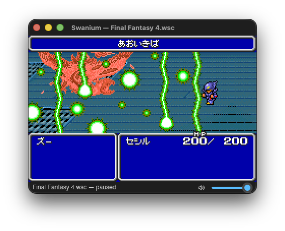
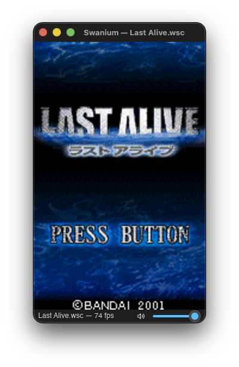

# Swanium - WonderSwan / WonderSwan Color Emulator

<p align="center">
  
</p>

Swanium is a modern, cross-platform **WonderSwan / WonderSwan Color** emulator written in Rust, with cycle-accuracy as a first-class goal.

<p align="center">
  <a href="https://github.com/bubio/Swanium/releases/latest">
    
  </a>
  <a href="https://github.com/bubio/Swanium/blob/main/LICENSE">
    
  </a>
  <a href="https://github.com/bubio/Swanium/releases/latest">
    
  </a>
  <a href="https://github.com/bubio/Swanium/actions/workflows/ci-linux.yml">
    
  </a>
  <a href="https://github.com/bubio/Swanium/actions/workflows/ci-macos.yml">
    
  </a>
  <a href="https://github.com/bubio/Swanium/actions/workflows/ci-windows.yml">
    
  </a>
</p>

Swanium separates a platform-independent core (`swanium-core`) from desktop frontend integrations (Slint, cpal, gilrs), so emulation logic stays deterministic and reusable while still providing a native GUI app experience on major desktop platforms.

<p align="center"></p>
<p align="center"></p>

## Key Features

- **Cycle-Accuracy Focus:** Timing- and register-precision work is guided by public ROM oracles and hardware references.
- **Platform-Independent Core:** CPU, memory map, interrupts, timers, DMA, PPU, APU, cartridge, and RTC live in `crates/core` with no GUI/audio/input dependency.
- **Cross-Platform Frontend:** Slint-based desktop UI with keyboard/gamepad input and cpal audio output.
- **WonderSwan + WonderSwan Color:** Mono and color rendering paths, color palettes, RTC handling, and HyperVoice support.
- **Configurable UX:** ROM history, menu/status UI, native file picker, and persistent settings.
- **CI-Packaged Releases:** Platform workflows build/test/lint and produce macOS, Linux, and Windows release artifacts.

## Download

Prebuilt binaries are available on the [**Releases**](https://github.com/bubio/Swanium/releases/latest) page.

| Platform | Artifact format | Typical asset names |
|----------|-----------------|---------------------|
| macOS | `.zip` (unsigned universal app bundle) | `Swanium-{version}-macos-universal.zip` |
| Linux | `.deb`, `.rpm` | `Swanium-{version}-linux-{x64,arm64}.{deb,rpm}` |
| Windows | `.zip` | `Swanium-{version}-windows-{x64,arm64}.zip` |

> Note for macOS: Since this app has not been notarized by Apple, it may be blocked by Gatekeeper when launched for the first time.
> You can resolve this using one of the following methods:
> **Method 1: Remove the quarantine flag via Terminal**
> ```bash
> xattr -cr /Applications/Swanium.app
> ```
>
> **Method 2: Allow via System Settings**
> 1. Attempt to open the app and let it get blocked
> 2. Open **System Settings** → **Privacy & Security**
> 3. Click **"Open Anyway"** next to the message about Swanium being blocked

## Building

Rust stable is required (see `rust-toolchain.toml`).

```bash
cargo build --workspace
cargo test --workspace
cargo clippy --workspace --all-targets -- -D warnings
cargo fmt --all -- --check
```

### macOS App Bundle

Build an unsigned universal app bundle on macOS:

```bash
scripts/build-macos-app.sh
```

Outputs:

- `target/release/Swanium.app`
- `target/release/Swanium-{version}-macos-universal.zip`

### Linux Packages

Build `.deb` and `.rpm` packages on Linux (requires `cargo-deb` and `cargo-generate-rpm`):

```bash
scripts/build-linux-app.sh --architecture x64 --dist-dir dist
```

Outputs:

- `dist/deb/Swanium-{version}-linux-x64.deb`
- `dist/rpm/Swanium-{version}-linux-x64.rpm`

### Windows Package

Build and package on Windows (PowerShell):

```powershell
./scripts/build-windows-app.ps1 --target x86_64-pc-windows-msvc
```

Output: `dist/Swanium-{version}-windows-x64.zip`

## Usage

Launch the packaged app and open a ROM from **File > Open ROM…** (`Ctrl+O`).

From source, you can also run with an optional ROM path:

```bash
cargo run -p frontend -- path/to/game.ws
cargo run -p frontend
```

Default controls:

- Arrow keys = X-pad
- `W A S D` = Y-pad
- `X` = A, `Z` = B
- `Enter` = Start

## Accuracy References

Swanium validates behavior against primary WonderSwan documentation and public test projects:

- [WSDev Wiki](https://ws.nesdev.org/wiki/WSdev_Wiki)
- [WonderSwan - Sacred Tech Scroll](http://perfectkiosk.net/stsws.html)
- [FluBBaOfWard/WSCPUTest](https://github.com/FluBBaOfWard/WSCPUTest)
- [asiekierka/ws-test-suite](https://github.com/asiekierka/ws-test-suite)
- [FluBBaOfWard/WSTimingTest](https://github.com/FluBBaOfWard/WSTimingTest)
- [FluBBaOfWard/WSHWTest](https://github.com/FluBBaOfWard/WSHWTest)

## Architecture

```text
Slint GUI -> Frontend App -> { Audio (cpal), Input (gilrs) }
                                          |
                                          v
                Emulator Core: CPU, Memory, Interrupts, Timers, DMA, PPU, APU, Cartridge, RTC
```

The core crate (`crates/core`, package name `swanium-core`) remains headless and platform-independent by design.

## License

MIT — see [LICENSE](LICENSE).
